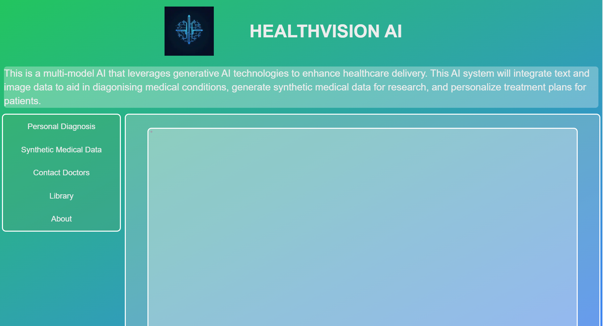

# HealthVision AI

HealthVision AI is a multimodal AI-powered healthcare solution designed to diagnose medical conditions using text and imaging data, generate synthetic medical data, and personalize treatment plans. Leveraging state-of-the-art machine learning models, HealthVision AI aims to advance healthcare accessibility, improve diagnostic accuracy, and empower medical professionals with robust decision-making tools.

## Table of Contents :
- [HealthVision AI](#healthvision-ai)
  - [Table of Contents :](#table-of-contents-)
  - [Introduction](#introduction)
  - [Features](#features)
  - [Installation](#installation)
  - [Usage](#usage)
  - [Note](#note)

## Introduction

HealthVision AI is built to support healthcare professionals in diagnosing conditions using both medical images (e.g., X-rays, CT scans) and patient text records. The system integrates various AI models for:

- Multimodal medical diagnosis (text and images).
- Generating synthetic medical data for research and training.
- Creating personalized treatment plans for patients.
- 
It also aims to:

- Enhance medical imaging analysis and natural language understanding.
- Enable real-time diagnostic suggestions.
- Support telemedicine solutions and improve patient care efficiency.

## Features

- **Multimodal AI Diagnosis:** Combines text and image data to provide accurate medical diagnoses.

- **Synthetic Data Generation:** Generates synthetic medical data for training purposes.
- **Personalized Treatment Plans:** Suggests customized treatment plans based on patient history.
- **Real-time Insights:** Offers instant diagnostic feedback to healthcare professionals.
- **Data Security:** Ensures all sensitive medical data is processed securely with encryption.

## Installation

1. Clone this repository to your local machine.
2. Go to folder `healthvision_ai` and open terminal. Type `npm install` to install dependencies.
3. Open terminal and run `npm run dev` to start the server.
4. Visit `http://localhost:3000` to access the web app.

## Usage

Once the application is running, you can:

1. Upload Medical Images: Use the upload interface to input patient images for diagnosis.
2. Input Patient Data: Input patient records or text data for a multimodal diagnosis.
3. Receive Diagnostic Results: Get real-time AI-powered diagnostic suggestions and treatment plans.

## Note

- Many features are still in development.
- Don't rely on AI. Always consult a doctor.
